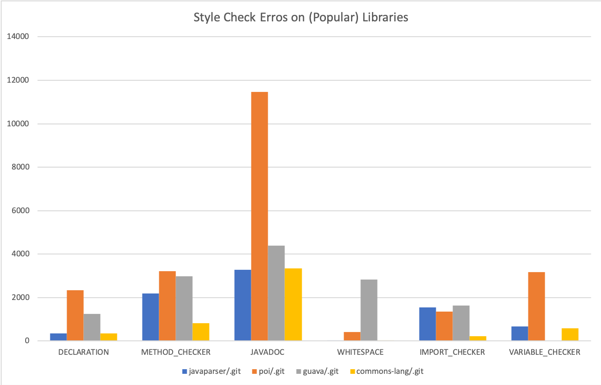
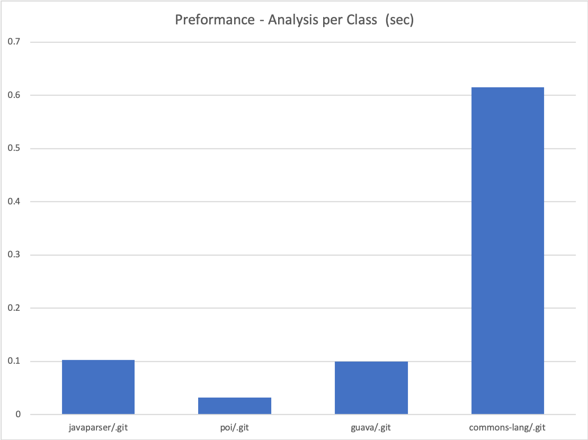

# Java Style Checker

## Members

* Jae Dong Hwang
* Steven Anderson
* Surya Appini
* Nivetha Sathyarajan
* Kate Maroney

## Tools

* JavaParser
  * Tool to parse source code into an AST for easy analysis

* JavaSymbolSolver
  * Gets you data about the nodes of the AST

* Google Java Style Guide
  * Defines acceptable whitespace, new lines, format, etc.

## Project Definition

* Base Set of Features:
  * Indent checking (Nivetha, Surya)
  * Extra whitespace (Nivetha, Surya)
  * Newlines (Nivetha, Surya)
  * Unused variables, imports, and methods (Kate)

* Smarter Static Checks 
  * variable/method name checking (Steven)
  * Documentation for public methods (Jae)

* Collector Model
  * Object passed to checkers (model/Issue)
  
* Auto-update
  * Fix improper indenting (Steven)
  * Update javadoc (Jae)

* Main.java

## Project Documents
* [User Document](https://docs.google.com/document/d/18qA1C3Z1E_V-I_pObiWWadm94s0TtogtX3wrY8ZeiN4/edit?usp=sharing)
* [Developer Document](doc/developer_note.md)
* [Evaluation Document](https://docs.google.com/document/d/18qA1C3Z1E_V-I_pObiWWadm94s0TtogtX3wrY8ZeiN4/edit?usp=sharing)

## Some Style Check Test Results

Below graph shows the results from checking styles on the (popular) library on GitHub.

## Performance Analysis

We use the ratio of total analysis time to number of class in each library. We learned that the performance isn't proportional to the number of classes, methods, and even the errors the tool finds.  For example, Guava, the library from Google has the more than double size of code base than apache commons-lang library.   

 

 Detailed data is the base for the analysis above. 

  |Git Repo.	|Commit	|Timestamp	|AnalysisInSeconds	|NumClasses	|NumMethods	|NumLines|
  |:-:|:-:|:-:|:-:|:-:|:-:|:-:|
  |javaparser/.git	|6cce95f413	|Tue Apr 30 07:02:41 PDT 2019	|49	|478	|5226	|55385|
  |poi/.git	|2e3f020c7a	|Sat Oct 23 05:15:57 PDT 2010	|31	|974	|8041	|122538|
  |guava/.git	|671cc99f7c	|Sat May 25 19:38:05 PDT 2019	|131	|1314	|10587	|185638|
  |commons-lang/.git	|22f91fa70d	|Tue May 28 04:39:24 PDT 2019	|136	|221	|2929	|77300|

### References:
* https://javaparser.org/
* https://tomassetti.me/getting-started-with-javaparser-analyzing-java-code-programmatically/
