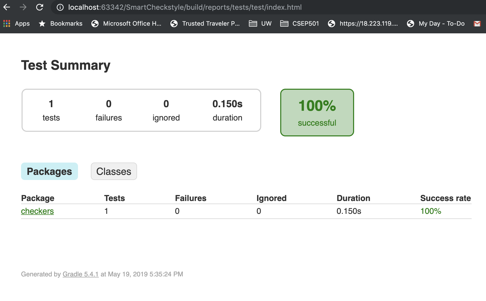

# Developer Document

## Build & Run

1. A developer can build this project with Gradle. The script, ```./gradlew``` should download and install all dependencies required, and below command will generate a build in ```build/libs/```folder.
   
   ```bash
    ./gradlew build
    gradle genJar
   ```

2. A developer can verify the build with below command. 
   ```bash
    java -jar build/libs/SmartCheckstyle-all-1.0-SNAPSHOT.jar -h
   ```

3. Checkers/modifiers get triggered based on the arguments, and they will print out the errors sorted by package name, file name, and line number.

    ```bash
    usage: ls [-d] [-h] [-i <arg>] [-im] [-j] [-m] [-md] [-n] [-r <arg>] [-va] [-ws]
        -d          check declarations style
        -h          options
        -i <arg>    input root directory or file path
        -im         check unused imports
        -j          check javadoc style
        -m          modify files
        -md         check unused methods
        -n          check new lines
        -r <arg>    generate error count report in a directory
        -va         check unused variables
        -ws         check whitespaces

    ```
## Adding A New Feature

A developer can extend existing capabilities by adding a new checker or modifier. Extending an existing visitor from java parser library is the easiest way of implementing a new feature.  Assuming that there is direct access to AST, a developer can focus on design and implement behavior (what to check/modify) specific to a node.

### New Checker/Modifier

1. Create a new checker class in ```src/main/java/checkers (or modifiers)``` folder.
   ```java
    public class MyNewChecker extends VoidVisitorAdapter<List<Issue>> {

    private String packageName;
    private String fileName;
    private final static String ISSUE_TYPE = "MY_NEW_CHECK_TYPE";
    
    public MyNewChecker(String fileName) {
        this.fileName = fileName;
    }
   ```

2. Then override the parent method for the node in business. 
   
   ```java
    @Override
    public void visit(FieldDeclaration n, List<Issue> issues) {
        super.visit(n, issues);
        if (n.isPublic()) {
            if (!n.hasJavaDocComment()) {
                int lineNumber = n.getRange().get().begin.line;
                String fieldName = n.getMetaModel().getMetaModelFieldName();
                issues.add(generateIssue(lineNumber, "Public field "
                        + fieldName + " is missing document."));
            }
        }
    }
   ```

### Integration and Error Aggregation

1. A developer also needs to integrate the new checker/modifier in the main function defining a new argument.
2. There would be a various way of aggregate style errors. In this project, we pass the reference to the collection of Issue objects when checker/modifier visits nodes. 

    ```java
    List<Issue> issues = new ArrayList<>();
    // ...
    JavadocChecker javadocChecker = new JavadocChecker(file.getName());
    javadocChecker.visit(compilationUnit, issues);
    ```

## Test

### Debugging and testing a checker/modifier

1. Manual testing
   The quick and easy way to test new checker/modifier is to create/find a java file with style error manually.  It forces the java parser to construct the CompilationUnit with the style error. This approach is useful at the beginning of implementation as a developer can learn the APIs and study the feasibility of style check. However, as the code gets mature or a developer gets used to the APIs, it would be demanded to utilize the test automation infrastructures

2. Using JUnit frameworks
   It's also useful to use the JUnit framework to test new checker/modifier. In unit tests, the developer can write the code that constructs an abstract syntax tree(AST) with a specific style error. And he/she also get AST from a sample file and modify(i.e., chop Javadoc) to miss some style. For example, the test code below applies the Javadoc remover class into the AST from a file. Then it asserts the number of issues found from the no-Javadoc AST.

   ```java
    public class JavadocRemover extends ModifierVisitor {

        //...
        
        @Override
        public Visitable visit(MethodDeclaration n, Object arg) {
            super.visit(n, arg);
            if (!n.isPrivate()) {
                removeJavadoc(n);
            }
            return n;
        
        //...
    }
   ```

    ```java
    public class JavadocCheckerTest{
    
        @Test
        public void testNoJavaDocInPublicClass() throws FileNotFoundException {
            
            ClassLoader classLoader = this.getClass().getClassLoader();
            String fileName = classLoader.getResource("checkers/DocumentChecker1.java").getFile();
            CompilationUnit cu = JavaParser.parse(new File(fileName));
            JavadocRemover jdr = new JavadocRemover();
            jdr.visit(cu, null);
        int cntRemoved = jdr.getJavadocRemovalCount();
            // assert it with the number of issues found by JavadocChecker.
    
    ```

3. Next level of automated testing - **with style mutation frameworks**.
   The previous two approaches might not be sufficient or efficient for production development. For *future and production*, it would also be possible to automate tests by pre-processing input files. For example, starting with top-quality open source projects, we can develop a tool that produces many style-based mutation datasets, i.e., unused import or variables. Then, it will be much easier to test new checkers and modifiers by inspecting the errors found. 

### Build test

A developer can runs all (unit) tests found from the src/test/java directory by using the following command at the command prompt.

```bash 
./gradlew clean test
```

With continuous integration environment, the test webpage will be accessible:


