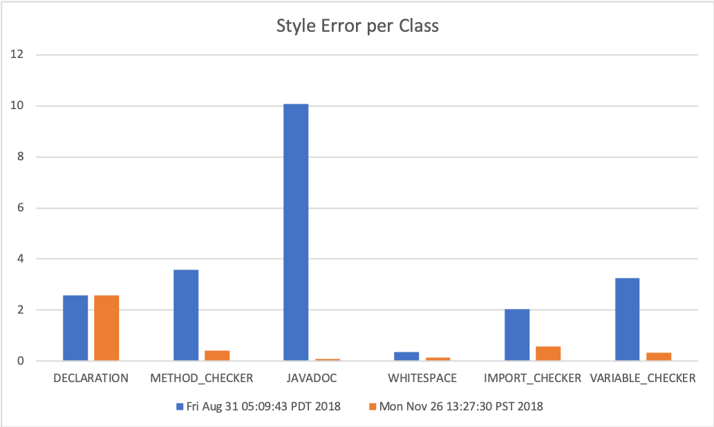

# Developer Document

## Build & Run

1. A developer can build this project with Gradle. The script, ```./gradlew``` should download and install all dependencies required, and below command will generate a build in ```build/libs/```folder containing all dependencies.
   
   ```bash
    ./gradlew clean genJar
   ```

2. A developer can verify the build with below command. 
   ```bash
    java -jar build/libs/SmartCheckstyle-all-1.0-SNAPSHOT.jar -h
   ```

3. Checkers/modifiers get triggered based on the arguments, and they will print out the errors sorted by package name, file name, and line number.

    ```bash
    usage: ls [-d] [-h] [-i <arg>] [-im] [-j] [-m] [-md] [-n] [-r <arg>] [-va] [-ws]
    -d          check declarations style
    -h          options
    -i <arg>    input root directory or file path
    -im         check unused imports
    -j          check javadoc style
    -m          modify files
    -md         check unused methods
    -n          check new lines
    -r <arg>    error report directory
    -va         check unused variables
    -ws         check whitespaces


    ```
## Adding A New Feature

A developer can extend existing capabilities by adding a new checker or modifier. Extending an existing visitor from java parser library is the easiest way of implementing a new feature.  Assuming that there is direct access to AST, a developer can focus on design and implement behavior (what to check/modify) specific to a node.

### New Checker/Modifier

1. Create a new checker class in ```src/main/java/checkers (or modifiers)``` folder.
   ```java
    public class MyNewChecker extends VoidVisitorAdapter<List<Issue>> {

    private String packageName;
    private String fileName;
    private final static String ISSUE_TYPE = "MY_NEW_CHECK_TYPE";
    
    public MyNewChecker(String fileName) {
        this.fileName = fileName;
    }
   ```

2. Then override the parent method for the node in business. 
   
   ```java
    @Override
    public void visit(FieldDeclaration n, List<Issue> issues) {
        super.visit(n, issues);
        if (n.isPublic()) {
            if (!n.hasJavaDocComment()) {
                int lineNumber = n.getRange().get().begin.line;
                String fieldName = n.getMetaModel().getMetaModelFieldName();
                issues.add(generateIssue(lineNumber, "Public field "
                        + fieldName + " is missing document."));
            }
        }
    }
   ```

### Integration and Error Aggregation

1. A developer also needs to integrate the new checker/modifier in the main function defining a new argument.
2. There would be a various way of aggregate style errors. In this project, we pass the copy of the reference to the collection of Issue objects when checker/modifier visits nodes. 

    ```java
    List<Issue> issues = new ArrayList<>();
    // ...
    JavadocChecker javadocChecker = new JavadocChecker(file.getName());
    javadocChecker.visit(compilationUnit, issues);
    ```

## Test

### Implementation, debugging and testing a new checker/modifier

#### 1. Manual testing

The quick and easy way to test new checker/modifier is to create/find a java file with style error manually.  It forces the java parser to construct the CompilationUnit with the style error. This approach is useful at the beginning of implementation as a developer can learn the APIs and study the feasibility of style check. However, as the code gets mature or a developer gets used to the APIs, it would be demanded to utilize the test automation infrastructures.

#### 2. Using JUnit frameworks

It's also useful to use the JUnit framework to test new checker/modifier. In unit tests, the developer can write the code that constructs an abstract syntax tree(AST) with a specific style error. Also, he/she also get AST from a sample file and modify(i.e., chop Javadoc) to miss some style. For example, the test code below applies the Javadoc remover class into the AST from a file. Then it asserts the number of issues found from the no-Javadoc AST.

```java
public class JavadocRemover extends ModifierVisitor {

    //...
    
    @Override
    public Visitable visit(MethodDeclaration n, Object arg) {
        super.visit(n, arg);
        if (!n.isPrivate()) {
            removeJavadoc(n);
        }
        return n;
    
    //...
}
```

```java
public class JavadocCheckerTest{

    @Test
    public void testNoJavaDocInPublicClass() throws FileNotFoundException {
        
        ClassLoader classLoader = this.getClass().getClassLoader();
        String fileName = classLoader.getResource("checkers/DocumentChecker1.java").getFile();
        CompilationUnit cu = JavaParser.parse(new File(fileName));
        JavadocRemover jdr = new JavadocRemover();
        jdr.visit(cu, null);
    int cntRemoved = jdr.getJavadocRemovalCount();
        // assert it with the number of issues found by JavadocChecker.

```

#### 3. Mutation testing using open source

The previous two approaches might not be sufficient or efficient for production development. For debugging and testing of a specific case, one can write or borrow small code snippets from other projects. To begin with, we have also located our small test sets in ```resources``` folder. However, we experienced that the approach makes the snippet code tends to be modified over time and produce unexpected test results. Sometimes, it can also cause incomplete implementation, although passing two naive code base. We also learned that manipulating AST using Java parser APIs to introduce style error itself can also be the buggy process itself. So we think mutation testing using old codebase can compensate for those the limitation. 

Here are the steps we suggest:

##### A. Select open source

There are many open source projects available on public repository services. Since we need somewhat large codebase and also public APIs designed for applications, a utility library with years of commit log would be good candidates. For example, Guava, Apache POI, and Apache Common utility are good candidates.

##### B. Produce style check report

Good candidate projects should have a list of tags. Going back to a tag back in a couple of years, and run source code with ```-r REPORT_DIRECTORY```. Below command will iterate java source code in ```poi/src``` folder, check Javadoc and declaration styles, and then produce a report ```~/Documents/report.csv```.

```bash
    $ java -jar build/libs/SmartCheckstyle-all-1.0-SNAPSHOT.jar -i /../poi/src -j -d -r ~/Documents/
```

##### C. Implement checker/modifiler

We recommend updating the Main class with argument option in the early stage of development. It will allow appending the errors counts to the report. 

##### D. Use codebase with reasonble delta

Another way of using the old code for mutating style is to iterate commits in-between two minor or major releases. For example, the Apache POI library had two minor release in 2018. We can check styles against two commits and compare the errors found. We might be careful to pick two tags too far since the code might get modified in many places, then we might not consider them to be mutation set. To get the two commits reasonably mutated, we can pick two *minor* releases.

```bash
$ git for-each-ref --sort=-taggerdate --format '%(refname) %(taggerdate)' refs/tags
refs/tags/REL_4_1_0 Fri Apr 5 22:43:53 2019 +0000
refs/tags/REL_4_0_1 Mon Nov 26 21:27:30 2018 +0000
refs/tags/REL_4_0_0_FINAL Fri Aug 31 12:09:43 2018 +0000
```

Then we iterates below two steps.

```bash
$ git checkout refs/tags/REL_4_0_0_FINAL
$ java -jar ../SmartCheckstyle-all-1.0-SNAPSHOT.jar -i . -j -d -new_checker -r .
```

```bash
$ git checkout refs/tags/REL_4_0_1
$ java -jar ../SmartCheckstyle-all-1.0-SNAPSHOT.jar -i ./poi/src -j -d -new_checker -r .
```

With ```-r .``` arguments, we should generate ```report.csv``` with the report of table below.

|Git Repo.    |Commit    |Timestamp    |AnalysisInSeconds    |NumClasses    |NumMethods    |NumLines    |DECLARATION    |METHOD_CHECKER    |JAVADOC    |WHITESPACE    |IMPORT_CHECKER    |VARIABLE_CHECKER |
|:-:|:-:|:-:|:-:|:-:|:-:|:-:|:-:|:-:|:-:|:-:|:-:|:-:|
|Repository[/poi/.git]    |b41ee58404    |Fri Aug 31 05:09:43 PDT 2018    |49    |1334    |11652    |174391    |3434    |4759    |13443    |463    |2712    |4333|
|Repository[/poi/.git]    |69b0652676    |Mon Nov 26 13:27:30 PST 2018    |47    |1337    |11597    |174532    |3440    |4741    |13362    |464    |2718    |4340|

Instead of comparing the number of errors, we can compare/visualize the number of style error per class. From *REL_4_0_0_FINAL(blue)* to *REL_4_0_1(orange)*, we can see the improvements in all criteria. For new checker/modifier, one can find either the improvement or not depending on the goal and conclude different results. However, it should give enough context whether or not the implementation can find the expected errors. 



### Build test

A developer can runs all (unit) tests found from the src/test/java directory by using the following command at the command prompt. 

```bash 
./gradlew clean test
```

With continuous integration environment, the test webpage will be accessible:
<div style="display: flex; justify-content: center;">

</div>

